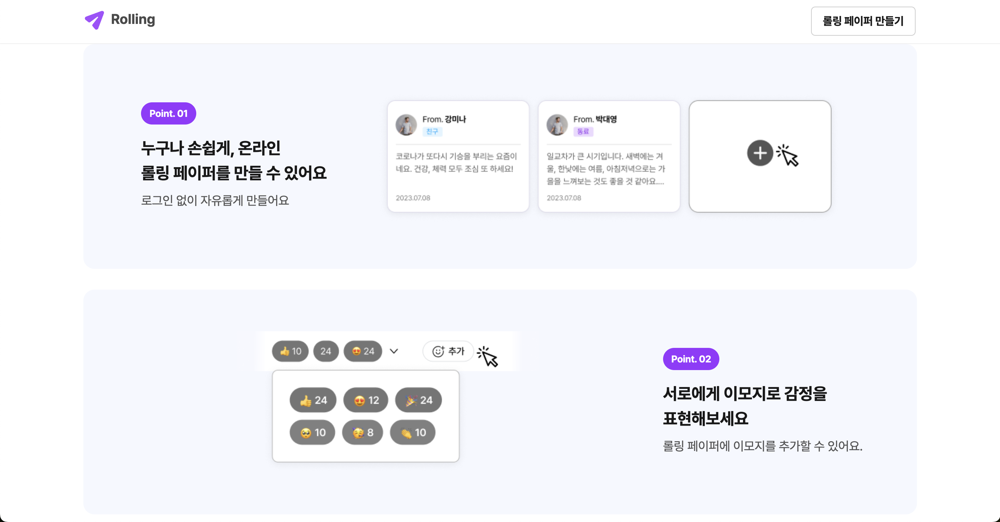
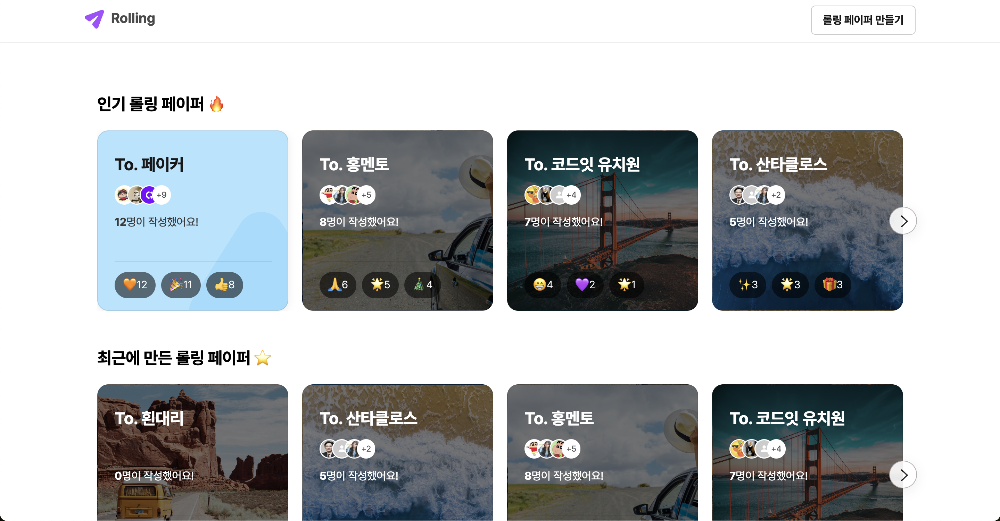
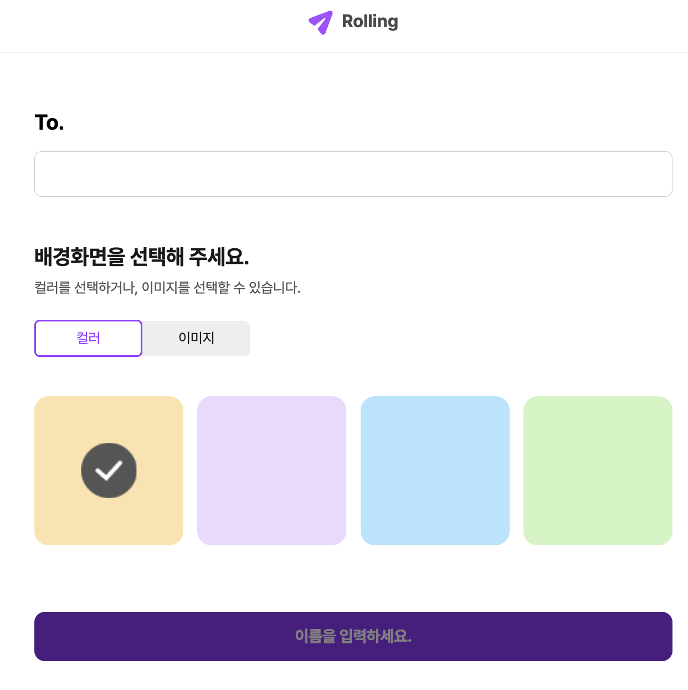
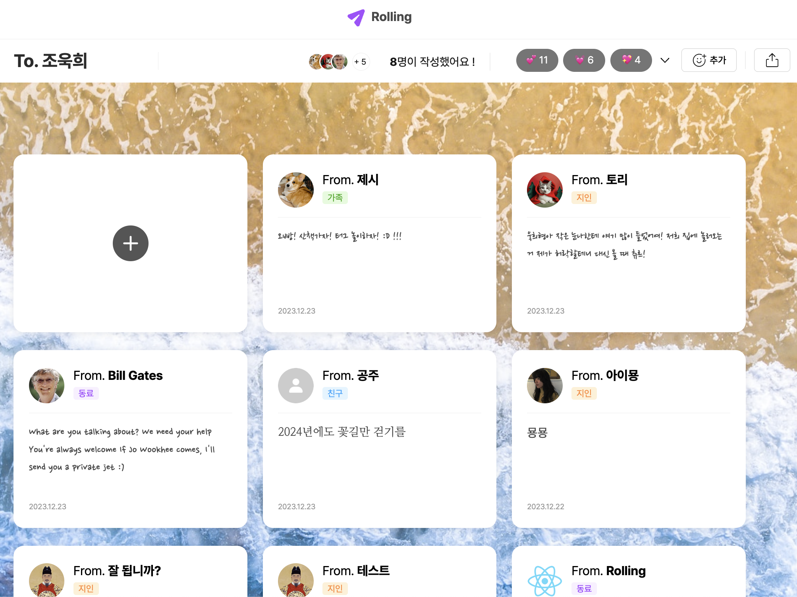
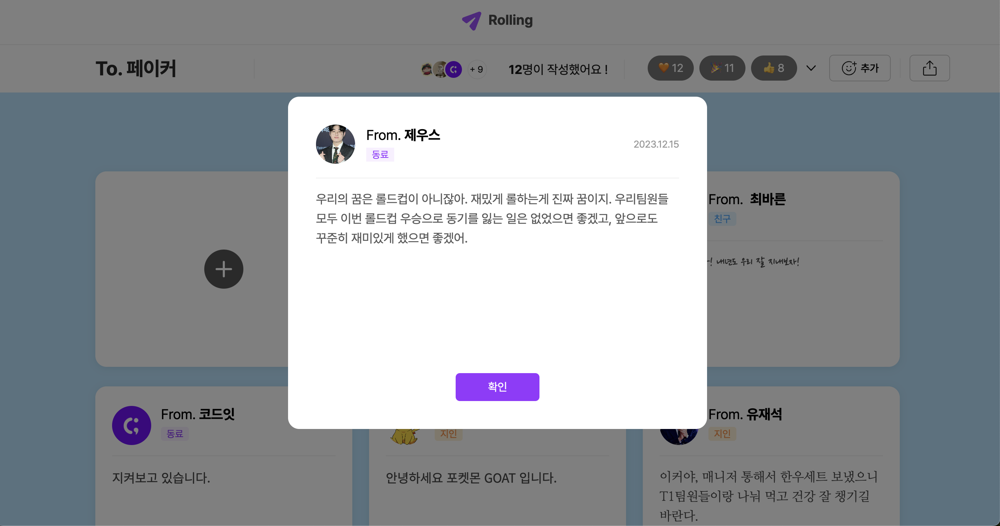
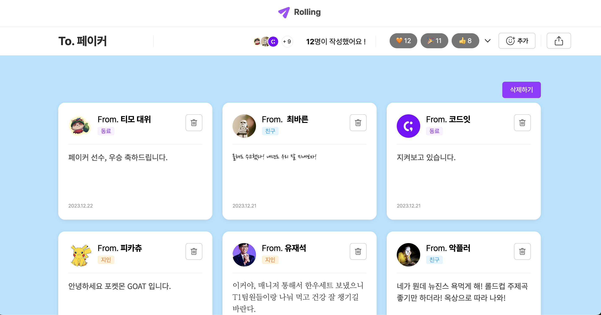
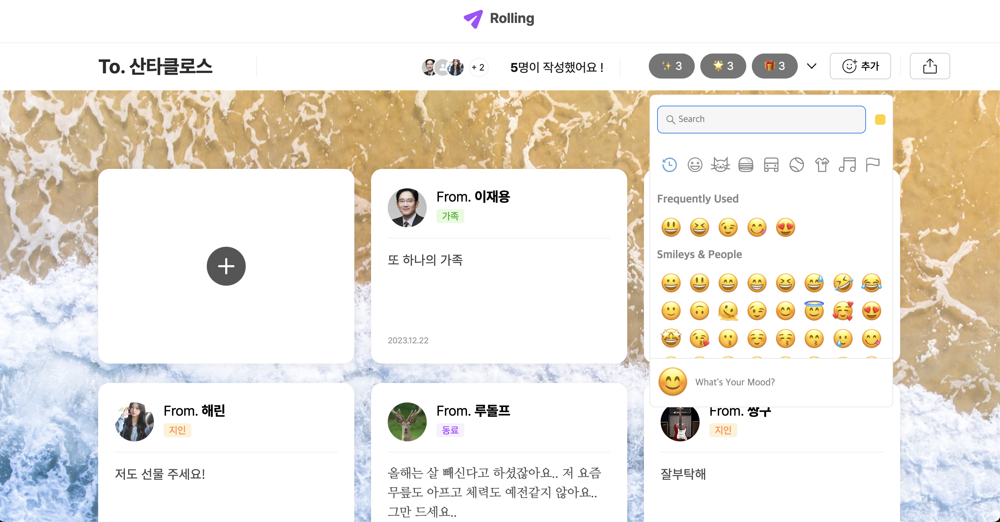
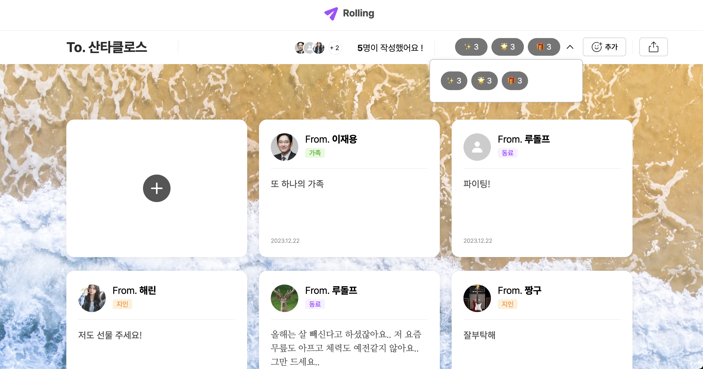
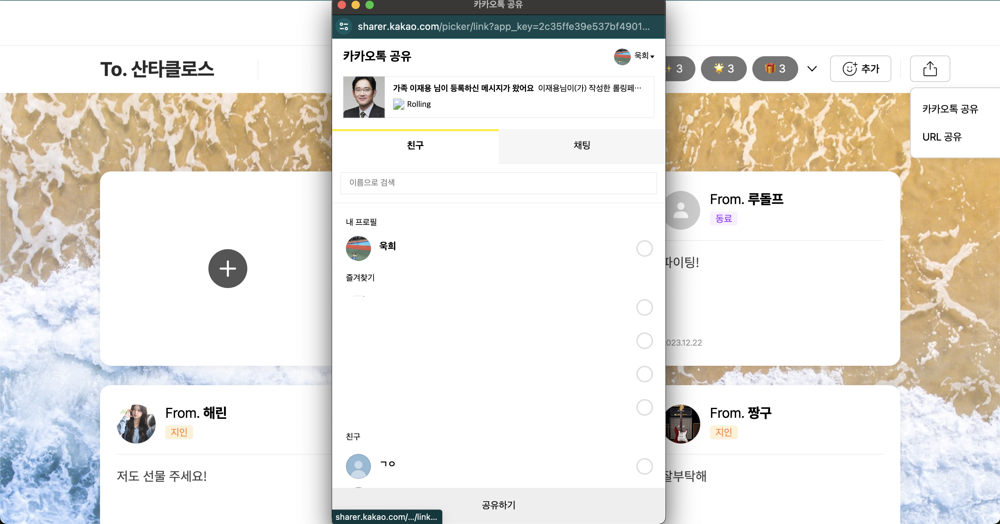
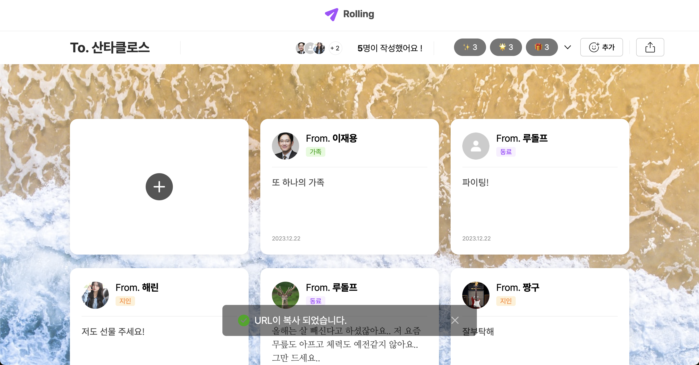

<h2>[2023] 추억의 롤링 페이퍼를 웹 상에서도 즐길 수 있는 플랫폼 '롤링' 서비스</h2>
연말의 마지막 메시지를 전달해보는건 어떨까요?, 로그인을 하지 않아도 남길 수 있는 따뜻한 메시지, Rolling입니다!  상대방이 어떤 메시지를 써줄지 기다리는 두근거림을, 롤링을 통해 여러 메시지를 받으며 감정표현과 함께 두근거림을 느껴보세요 😊 

## 목차

- [목차](#목차)
- [개요](#개요)
- [프로젝트 이미지](#프로젝트-이미지)

## 개요

- 배포 URL: https://resonant-chimera-6a5866.netlify.app/
- 프로젝트명: Rolling 📝
- 기간: 2023.12.08-2023.12.22
- 기술스택

  
  
  
  

## 프로젝트 이미지

|    |     |
| :------------------------------------: | :------------------------------------: |
|               시작 화면                |           롤링 페이퍼 리스트           |
|  |     |
|           롤링 페이퍼 만들기           |       누군가 작성한 롤링 페이퍼        |
|    |         |
|      롤링 페이퍼 메시지 클릭 모달      |          롤링 페이퍼 편집하기          |
|     |  |
|              이모지 추가               |             추가된 이모지              |
|   |      |
|           카카오톡 공유하기            |              URL 복사하기              |
